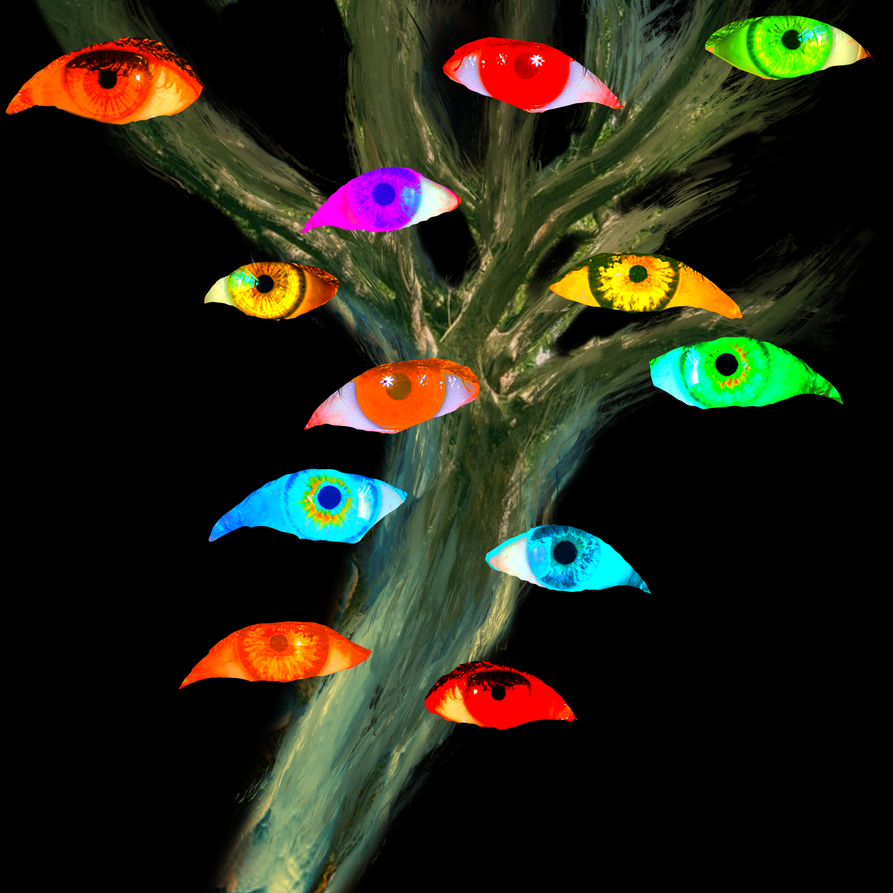

# Strange Birds Web Art

the goal of this project is to create a dynamic website based on the following digital drawing I made:

## Features

- scrollable box with images that stack 
- box background color transition on scroll
- body background effect transition on scroll
- text change on scroll based on percentage of page

## To-do

- add bird sounds on scroll
- add end scroll glitch animation
    * all dark
    * text glitch 
    * image glitch 

## Technologies Used

- HTML
- CSS
- Javascript
